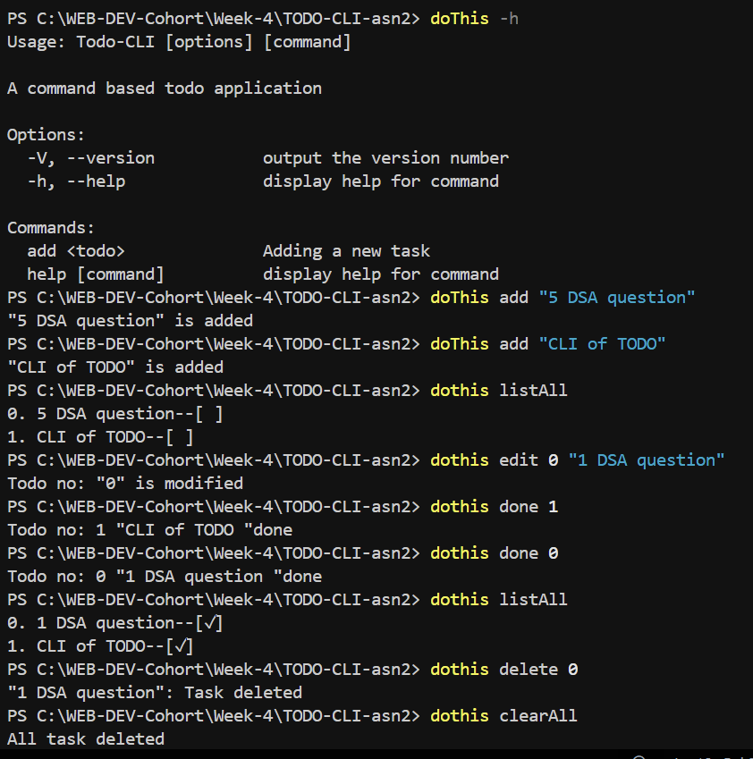

# 📝 CLI Todo List Application

A simple Command Line Interface (CLI) Todo List application built using Node.js and the Commander library. This tool helps you manage your tasks efficiently by storing them in a `todos.json` file.

## ✨ Features

- **➕ Add Task:** Add a new task to your todo list.
- **✏️ Edit Task:** Modify an existing task in your todo list.
- **❌ Delete Task:** Remove a task from your todo list by its index.
- **✅ Mark as Done:** Mark a task as completed.
- **📋 List All Tasks:** Display all tasks in your todo list.
- **🧹 Clear All Tasks:** Remove all tasks from your todo list.

## 🚀 Follow these steps to run the CLI on your local machine:

1. **Clone the repository** to your local machine:
2. Navigate to the **project directory**:
3. Install the necessary **dependencies**:
   ```bash
   npm install
   ```
4. Link the package globally: To write the command in this format: **doThis** instead of **node index.js** 
    ```bash
   npm link
   ```
5. **Run the CLI** by executing the available commands:

- **Add a Task:**

     ```bash
     node index.js add "<task>"
     ```
- **Edit a Task:**

     ```bash
     node index.js edit <index> "<New Task>" 
     ```
- **Delete a Task:**

     ```bash
     node index.js delete <index>
     ```
- **Mark done:**

     ```bash
     node index.js done <index>
     ```
- **Show all a Task:**

     ```bash
     node index.js listAll
     ```
- **Delete all task:**

     ```bash
     node index.js clearAll
     ```
- **To show all commands:**

     ```bash
     node index.js -h
     ```
### Preview👀



## 📂 Project Structure

```plaintext
CLI of a TODO Application
│
├── index.js           # Contains the logic for the CLI commands.
├── package.json       # Defines the project's dependencies, scripts, and CLI command mappings.
├── todos.json         # Stores the list of todos.
├── package-lock.json  # Records the exact versions of dependencies installed.
├── screenshort.png    # Command Screenshot
└── README.md          # Project documentation

